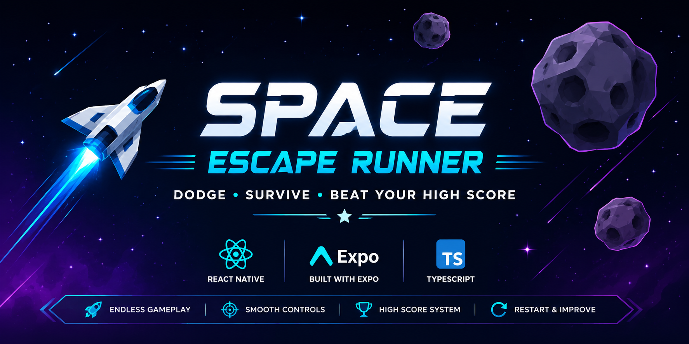
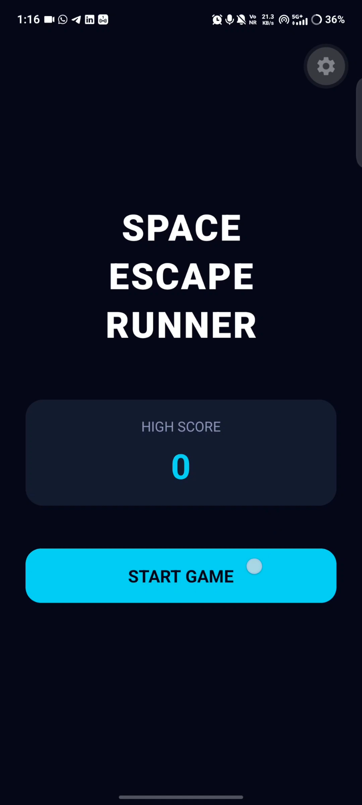
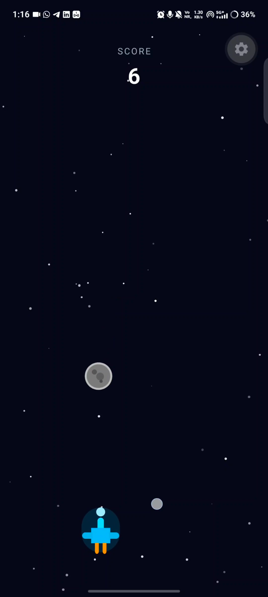
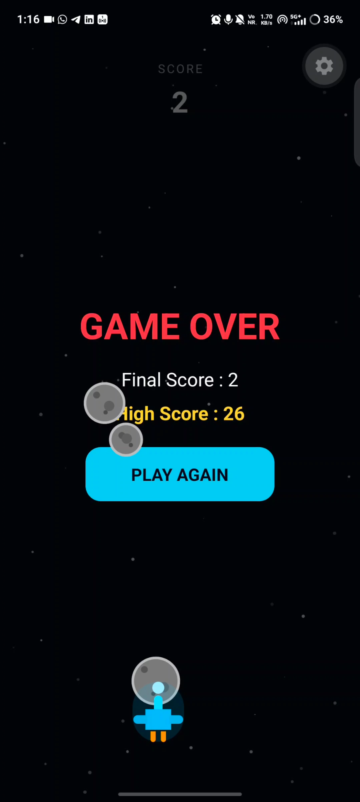
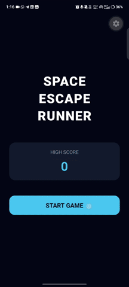

<p align="center">
  
</p>

<h1 align="center">🚀 Space Escape Runner</h1>

<p align="center">
A 2D endless space survival game built with React Native & Expo.
</p>

<p align="center">
Dodge • Survive • Beat Your High Score
</p>

---


# 🚀 Space Escape Runner


# 🚀 Space Escape Runner

A simple 2D endless space survival game built with **React Native** and **Expo**, where players control a spaceship to dodge falling asteroids, survive as long as possible, and achieve the highest score.

---

## 🎮 Features

- 🚀 Smooth drag-based spaceship controls
- ☄️ Multiple falling asteroids with random positions, sizes, and speeds
- 💥 Collision detection with Game Over
- 📈 Live score counter
- 🏆 Persistent High Score using AsyncStorage
- 🔄 Restart functionality
- 🌌 Animated space-themed UI built entirely with shapes (no image assets for gameplay)

---

## 🛠️ Technologies Used

- React Native
- Expo SDK 56
- Expo Router
- TypeScript
- React Native Reanimated
- React Native Gesture Handler
- AsyncStorage

---

## 📸 Screenshots

| Home | Gameplay | Game Over |
|------|-----------|-----------|
|  |  |  |

## 🎮 Demo



## 📂 Project Structure

```
src/
│── app/                # App screens
│── components/         # Reusable UI components
│── hooks/              # Game logic and custom hooks
│── constants/          # Game constants
│── utils/              # Utility functions
│── assets/             # Icons and app assets
```

---

## ▶️ Getting Started

### 1. Clone the repository

```bash
git clone https://github.com/Magesh-03-K/SpaceEscapeRunner.git
```

### 2. Navigate to the project

```bash
cd SpaceEscapeRunner
```

### 3. Install dependencies

```bash
npm install
```

### 4. Start the Expo development server

```bash
npx expo start
```

### 5. Run the application

- Install **Expo Go** on your Android device.
- Ensure your phone and computer are connected to the **same Wi-Fi network**.
- Scan the QR code displayed in the terminal using Expo Go.

Alternatively, press:

- `a` → Android Emulator
- `w` → Web Browser

---

## 📱 Building the Android APK

Install EAS CLI

```bash
npm install -g eas-cli
```

Login

```bash
eas login
```

Configure the project

```bash
eas build:configure
```

Generate an APK

```bash
eas build -p android --profile preview
```

---

## 🎯 Game Objective

- Drag the spaceship left and right.
- Avoid colliding with falling asteroids.
- Survive as long as possible.
- Beat your highest score.

---

## What I Learned

- React Native fundamentals
- Expo Router
- Reanimated
- Gesture Handler
- Game loops
- Collision detection
- State management

## 👨‍💻 Developer

**Magesh K**

GitHub: https://github.com/Magesh-03-K

---

## 📄 License

This project is developed for educational and learning purposes.
